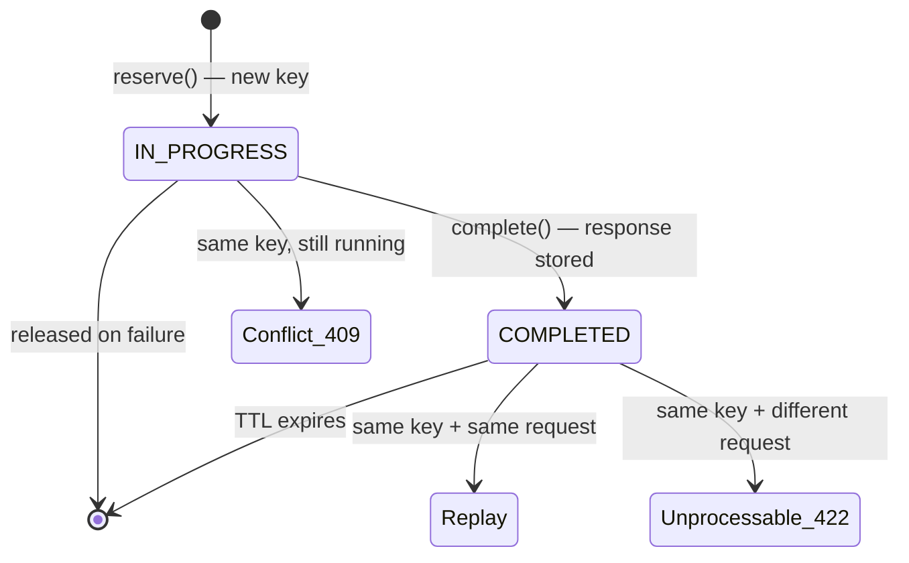

# spring-boot-starter-idempotency

[](https://github.com/arthurfaby/spring-boot-starter-idempotency/actions/workflows/build.yml)
[](https://central.sonatype.com/artifact/com.arthurfaby/spring-boot-starter-idempotency)
[](LICENSE)
[](https://adoptium.net/)
[](https://spring.io/projects/spring-boot)

> Make any mutating Spring endpoint **idempotent** with a single annotation. A client sends an
> `Idempotency-Key` header; the server executes the request **once** and replays the stored response
> for every retry — network retry, double-click, client timeout — without ever duplicating the side
> effect.

This is the pattern exposed by the **Stripe**, **Adyen** and **PayPal** APIs, standardised by the IETF
draft [*The Idempotency-Key HTTP Header Field*](https://datatracker.ietf.org/doc/draft-ietf-httpapi-idempotency-key-header/).

---

## The problem

A client calls `POST /payments`. The network drops before the response arrives. The client retries.
**Without idempotency → the customer is charged twice.** Unacceptable in finance.

With this starter, the retry replays the original response and the payment happens **exactly once**.

## Quickstart

**1. Add the dependency** (available from `0.1.0`):

```xml
<dependency>
    <groupId>com.arthurfaby</groupId>
    <artifactId>spring-boot-starter-idempotency</artifactId>
    <version>0.1.0</version>
</dependency>
```

**2. Annotate the endpoint:**

```java
@PostMapping("/payments")
@Idempotent
public Payment pay(@RequestBody PaymentRequest request) {
    return paymentService.charge(request); // runs at most once per Idempotency-Key
}
```

**3. That's it.** The auto-configuration wires everything. Send the same key twice:

```bash
KEY=$(uuidgen)

# 1st call → 201 Created, charges once
curl -XPOST localhost:8080/payments -H "Idempotency-Key: $KEY" \
  -H 'Content-Type: application/json' -d '{"amount":100,"currency":"CHF"}'
# → {"paymentId":"pay_1", ...}

# Retry with the same key → the SAME response is replayed, no second charge
curl -XPOST localhost:8080/payments -H "Idempotency-Key: $KEY" \
  -H 'Content-Type: application/json' -d '{"amount":100,"currency":"CHF"}'
# → {"paymentId":"pay_1", ...}   (identical)
```

A runnable demo lives in [`sample-app/`](sample-app).

## How it works

Each key moves through a small state machine:



| Scenario | Result |
|---|---|
| First request with a key | Handler runs; status + headers + body are stored |
| Retry — same key, same request | Stored response is **replayed** (no re-execution) |
| Same key, a request still **in progress** | `409 Conflict` |
| Same key, but a **different** request body | `422 Unprocessable Entity` |
| After the TTL elapses | Key is forgotten; treated as new |

- **Interception** — a `HandlerInterceptor` reads `@Idempotent` and maps the outcome to HTTP; a
  companion `OncePerRequestFilter` makes the request body re-readable and captures the response.
- **Concurrency** — reservations are **atomic per key** (`ConcurrentHashMap.compute`); of N concurrent
  requests sharing a key, exactly one is allowed through. Proven by a 64-thread test.
- **Storage** — pluggable via the `IdempotencyStore` SPI. Ships with a thread-safe in-memory store;
  JDBC and Redis are on the [roadmap](ROADMAP.md).

## Configuration

All properties are optional and prefixed with `idempotency`:

| Property | Default | Description |
|---|---|---|
| `idempotency.enabled` | `true` | Master switch (kill-switch) |
| `idempotency.header-name` | `Idempotency-Key` | Header carrying the key |
| `idempotency.default-ttl` | `24h` | Key retention (override per endpoint via `@Idempotent(ttl = "1h")`) |
| `idempotency.methods` | `POST, PATCH` | HTTP methods eligible for idempotency |

## Custom storage

Provide your own `IdempotencyStore` bean and the default backs off automatically:

```java
@Bean
IdempotencyStore idempotencyStore() {
    return new MyRedisIdempotencyStore(...);
}
```

## Compatibility

| | |
|---|---|
| **Java** | 21+ |
| **Spring Boot** | 3.x (built and tested on 3.5) |

## Contributing

Issues and pull requests are welcome — see [CONTRIBUTING.md](CONTRIBUTING.md). This project follows
the [Contributor Covenant](CODE_OF_CONDUCT.md) code of conduct.

## License

[Apache License 2.0](LICENSE).
